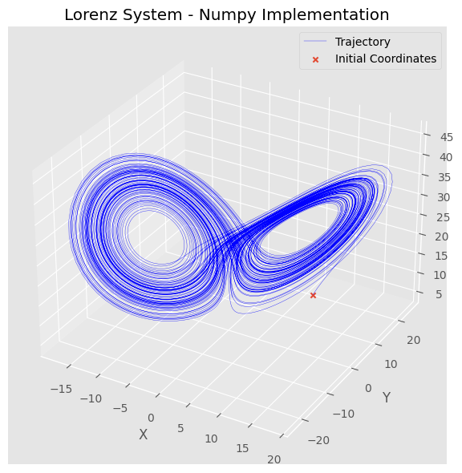

# Autoregressive rollout in jax

## Introduction

Python has a very simple and intuitive syntax that makes the developing time of a project, generally, short. The issue with python is when we start to consider the executive time for projects, especially intentive simulation and modelling jobs. In these scenarios julia or Matlab could be better suited to the task.

One of the reasons python is slow in these simulation and physics environments is that they requiure extensive control flow. There is lots of looping and conditions which python is not very good at. We will be using [JAX](https://docs.jax.dev/en/latest/index.html) in the post today to try an cirucmvent these control flow bottlenecks in python programs. JAX is an open source python package made by Google, provides simple API's and functional transformations to make python more performant while keeping the simple syntax. Specifically, what we will be looking into today is the [jax.lax.scan](https://docs.jax.dev/en/latest/_autosummary/jax.lax.scan.html), which I will call _scan_ for short.

## What is _scan_ good for?

In the simulation of dynamical systems, for example, we are confronted with the situation of moving the coordinates through time using the rules given by some differential or difference equations. For reasons we will see late, I will call this carry. We are looking to carry initial coordinates through time in order to compute the **trajectory**. This is type of problem that _scan_ is very well suited for.

## Solution with Numpy and JNP

But before we discuss the usage of _scan_, let us discuss a simple solution to this problem. We can define some stepper, a function that takes in coordinates at the current timestep and returns the coordinates at the next timestep. We could then define a variable called trajectory and append to this at each iteration in the loop. Finally, we just set the next coordinates that have been returned from the stepper as the coordinates. It would look something like this for the Lorenz system:

```python
import numpy as np

class LorenzRK4StepperNP:
    def __init__(self, sigma=10., rho=28., beta=8/3, tau=0.01):
        self.sigma = sigma
        self.rho = rho
        self.beta = beta
        self.tau = tau

    def __call__(self, coords):

        def lorenz_rhs(coords, sigma=self.sigma, rho=self.rho, beta=self.beta):
            return np.array(
                [
                    sigma * (coords[1] - coords[0]),
                    coords[0] * (rho - coords[2]) - coords[1],
                    coords[0] * coords[1] - beta * coords[2],
                ]
            )

        k_1 = self.tau * lorenz_rhs(coords)
        k_2 = self.tau * lorenz_rhs(coords + (1 / 2) * k_1)
        k_3 = self.tau * lorenz_rhs(coords + (1 / 2) * k_2)
        k_4 = self.tau * lorenz_rhs(coords + k_3)

        new_coords = coords + (1 / 6) * (k_1 + 2 * k_2 + 2 * k_3 + k_4)

        return new_coords


def rollout_loop(stepper, init_coords, length):
    coords = init_coords
    traj = [init_coords]

    for _ in range(length):
        coords = stepper(coords)
        traj.append(coords)

    return traj

sigma=10.
rho=28.
beta=8/3
tau = 0.01
stepper_np = LorenzRK4StepperNP(sigma, rho, beta, tau)

init_coords = np.full((3,), 10)

final_time = 100
length=int(final_time / tau)

%timeit rollout_loop(stepper_np, init_coords, length)
```

    91.8 ms ± 1.78 ms per loop (mean ± std. dev. of 7 runs, 10 loops each)



This is a perfectly valid solution to this problem. As we can see, the short final time that we are integrating to is very quickly reached by this Numpy implementation. The issue is that as we make the final time larger, or increase the number of initial conditions, a loop based approach like this will not scale well. We will need to implement some vectorised and compiled function in order to speed up the computation. This is where JAX can help. While, JAX provides an almost identical API to Numpy, via [jax.numpy](https://docs.jax.dev/en/latest/jax.numpy.html#module-jax.numpy) we need to be careful. A simple drop in replacement **does not** always speed up computation, actually it often slows the program down:

```python
import jax.numpy as jnp

class LorenzRK4StepperJNP:
    def __init__(self, sigma=10.0, rho=28.0, beta=8 / 3, tau=0.01):
        self.sigma = sigma
        self.rho = rho
        self.beta = beta
        self.tau = tau

    def __call__(self, coords):
        def lorenz_rhs(coords, sigma=self.sigma, rho=self.rho, beta=self.beta):
            return jnp.array(
                [
                    sigma * (coords[1] - coords[0]),
                    coords[0] * (rho - coords[2]) - coords[1],
                    coords[0] * coords[1] - beta * coords[2],
                ]
            )

        k_1 = self.tau * lorenz_rhs(coords)
        k_2 = self.tau * lorenz_rhs(coords + (1 / 2) * k_1)
        k_3 = self.tau * lorenz_rhs(coords + (1 / 2) * k_2)
        k_4 = self.tau * lorenz_rhs(coords + k_3)

        new_coords = coords + (1 / 6) * (k_1 + 2 * k_2 + 2 * k_3 + k_4)

        return new_coords

stepper_jnp = LorenzRK4StepperJNP(sigma, rho, beta, tau)

init_coords = jnp.full((3,), 10)
length = int(final_time / tau)

%timeit rollout_loop(stepper_jnp, init_coords, length)
```

    20.5 s ± 284 ms per loop (mean ± std. dev. of 7 runs, 1 loop each)

Suddenly, by just replacing _np_ with _jnp_ the average computation time of the trajectoy went from ~90ms to 20s. For reasons that will be discussed later, JAX does not perform very well in normal python loops. There are extremely fast implementations of looping logic that JAX offers, one of which is the _scan_ functional.

## Using _scan_

_scan_ takes in four main arguments that pertain to us.

1. **f**: This is a function that is used to move the system, kind of like the stepper method called in the body of the loop, however this method needs to have a very specific signature which we will discuss in a little bit.
2. **init**: These are the initial conditions that will be passed into the function **f**, in other words this is the initial "carry".
3. **xs**: Again, this is an array that will be passed to the function **f** during each iteration, this is used for some external force, like the control or action in a reinforcement learning problem.
4. **length**: The number of iterations that will be run.

That is a lot of information but I think it will all makes sense if we look at what a vanilla python implementation of the _scan_ function would be:

```python
def scan(f, init, xs, length=None):
  if xs is None:
    xs = [None] * length
  carry = init
  ys = []
  for x in xs:
    carry, y = f(carry, x)
    ys.append(y)
  return carry, np.stack(ys)
```

First off, we can see what the specific signature of the function **f** is. It is a function that takes in carry in its first argument. This is why I used carry to mean coordinates earlier, and it also takes in an **x** from the **xs**. **f** then passes back the new carry, as well as **y** which then gets appended to an array, and returned as a stack. To translate this into the scernario we care about. The "carry" is returned but the function, then needed an input - in that way it behaves as coorindates do in the Numpy implementation. **ys** are not really considered during the loop but they store data and are returned at the end, in that way they behave like a trajectory. If we were to return coordinates in the first and second position, the information would carry from loop to loop **and** we would compute the trajectory,

**f** takes in a second argument which, as I mentioned, is related to some external input or force, we will not be needing that in this scernatio.

Let us refactor the Numpy implementation. The main change to the code will be rollout function. Instead of rollout being a function, we will make it a function transformatio, ie. it will return a function, this is just so that we do not need to handle the two inputs and two outputs that the scan function needs. We will just wrap it in a transoformation and call the transformed rollout.

```python
import jax

def rollout_scan(stepper):

    def scan_fn(coords, _):
        new_coords = stepper(coords)
        return new_coords, new_coords

    def rollout_fn(init_coords, length):
        _, trajectory = jax.lax.scan(scan_fn, init_coords, None, length)

        return trajectory

    return rollout_fn

%timeit rollout_scan(stepper_jnp)(init_coords, length).block_until_ready()
```

    55.1 ms ± 1.64 ms per loop (mean ± std. dev. of 7 runs, 10 loops each)


We can see that qualitatively, the Lorenz plots are produced are the same. I say qualitatively since we can see that there are differences, like the **scan** plot has a couple isolated paths on the outside of the butterfly. This difference is due to the fact that JAX uses single precision and Numpy uses double precision by default. Since we know this is a chaotic system, a simple implementation detail like this will have large impacts on the exact trajectory.

In terms of performance, we see that this transformation and implementation with _scan_ has beaten even the Numpy implementation over this small time horizon. Next, we can compare the two implementations over longer integration times.


Initially, we see that the numply implementation is actually faster than the scan. But as soon as the length grows, the numpy implementation grows linearly (it loops exponential but that is just because the x-axis is the logarithm ), and the jax implementation is almost constant which is just remarkable, this is until \(10^5\) iterations. We see the scan implementation then start to increase from \(10^5, \ 10^5, 10^7\) similarly to how Numpy grew 2 orders of magnitude earlier. Meaning that the scan implmenttion is one hundred times faster than the numpy. This speedup is not even considering the implementation with specialised processing units, this speedup is on a vanilla CPU.

The main question is how? How can JAX do this?

To answer this, lets consider why JAX was so slow in a normal loop. At a low level, JAX converts linear algebra operations into [XLA](https://openxla.org/xla) operations. A normal python loop will be unenrolled and each operation in an iteration will be a node on that graph. Naturally, this will not be very efficient since the the construction and execution of this graph can be slow is the graph is too large. The _scan_ function converts the code into a singe XLA while operations which means the computation can be run incredibly fast on your processing unit.

## Conclusion

While it is obvious that this _scan_ functional is not replacing loops, we may still need the indexing and small loops may be faster than _scan_. It is incredible how much faster some computations can be when they do confirm to the correct signature and situation that is required. This is just a taste of what JAX can do, even what the _scan_ functional can do. What we will discuss in another post is how we can use both scan and [jax.vmap](https://docs.jax.dev/en/latest/_autosummary/jax.vmap.html) to create an incredibly fast routine to compute the maximal characteristic Lyapunov exponent in another chaotic system.

## References

[JAX.lax.scan tutorial (for autoregressive rollout)](https://www.youtube.com/watch?v=NlQ1N3W3Wms)

[Largest Lyapunov Exponent using Autodiff in JAX/Python](https://www.youtube.com/watch?v=zRMBIkpcuu0)
